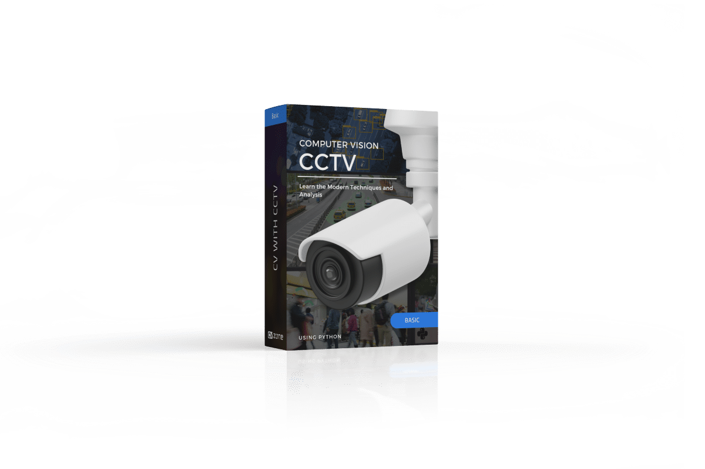
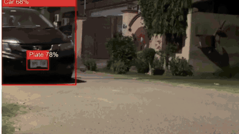
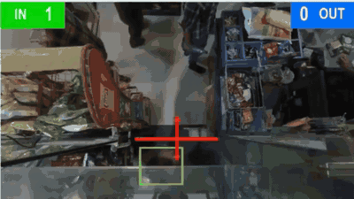

# CVZone Email Marketing Agent

<div align="center">

[](https://www.computervision.zone/)

[](https://www.computervision.zone/)
[](https://www.youtube.com/@murtazasworkshop)
[](#-sample-generated-email-preview)

> An autonomous, deterministic AI marketing campaign compiler built for [Computer Vision Zone](https://www.computervision.zone/) to upscale technical course and product sales across a community of **490K+ platform users** and **450K+ YouTube subscribers**.

</div>

---

## 🥊 The Problem

Running multi-email marketing campaigns for a high-traffic technical education brand faces major failure points when using standard LLMs:

* **Hallucination of Specs & Pricing:** Generic AI invents fake curriculum modules, non-existent stats, and inaccurate prices.
* **Brand Voice Drift:** LLMs default to corporate filler (*"synergize", "unlock potential"*), violating Murtaza's direct, practical "learn-by-building" tone.
* **Email Client Breakage:** Standard HTML output breaks across Outlook, Gmail, and Apple Mail due to unsupported CSS and divs.
* **Campaign Fatigue:** Standard prompts repeat generic sales pitches across multi-day campaigns instead of rotating narrative angles.

---

## 💡 The Solution

A **deterministic AI campaign compiler** that treats campaign generation like software engineering:

* **Zero-Hallucination Grounding:** Strictly references local course/product specification files (`course_file.md`).
* **Rigid Component Grammar:** Enforced through [`components.json`](./system/components.json) dictating sentence counts, formatting, and forbidden vocabulary.
* **Bulletproof HTML:** Generates table-based, inline-CSS, 600px responsive templates with hidden preheaders and CAN-SPAM compliance.
* **Dynamic Psychological Sequencing:** Rotates through 9 distinct angles (Real-World Story, Career ROI, Problem $\rightarrow$ Solution, Demo Showcase, Pricing Deep Dive).

---

## 🎯 Core Use Cases

| Use Case | Campaign Arc | Key Objective |
|:---|:---|:---|
| **Course Flash Sales** | 4–8 emails over 3–7 days (Announcement $\rightarrow$ Story/Value $\rightarrow$ 1-Day Left $\rightarrow$ Last Chance) | Drive high-urgency course conversions using real countdown timers and strike-through pricing without false scarcity. |
| **Product Launches** | Benefit-first sequence (e.g. *PySimverse* Kickstarter) | Scale SaaS & developer tool sales by highlighting outcomes, founder pricing, and frictionless simulation. |
| **YouTube Video Blasts** | Single curiosity-driven blast | Uses the "Curiosity Rule"—drives community traffic to YouTube releases without spoiling the conclusion in the email body. |
| **Lesson Announcements** | Targeted educational update | Informs existing students of added modules with direct links and live demo GIF showcases. |

---

## ⚙️ Architecture & Workflow

```text
[User Request / Campaign Brief]
             │
             ▼
[File Map Ingestion] ──► brand_document.md + components.json + course_file.md
             │
             ▼
[Subject Line Generator] ──► 9-angle formula (<60 chars, approved before writing)
             │
             ▼
[CountdownMail REST API] ──► Generates synchronized live GIF countdown timer
             │
             ▼
[Deterministic HTML Compiler] ──► Generates 01_announcement.html ... 08_last_chance.html
```

---

## 📬 Sample Generated Email Preview

Below is an authentic sample of an announcement email (**`01_announcement.html`**) generated by the agent for the *Computer Vision with CCTV* campaign, formatted for both GitHub and IDE Markdown previews:

---

<div align="center">

[](https://www.computervision.zone/)

**COMPUTER VISION ZONE • SPECIAL FLASH SALE**

</div>

---

### 🚨 The demand for AI in CCTV is skyrocketing. Here is how to get ahead.

**Hey Visionary,**

Security cameras are installed everywhere—yet 95% of them are completely passive. They record video, consume storage, and do nothing until an incident has already occurred.

The industry is rapidly shifting to **active edge AI analytics**, and companies are actively searching for developers who can build automated, real-time computer vision monitoring systems.

<div align="center">



</div>

---

### 🛠️ What You Will Actually Build

In this course, you won't study dry theory. You will build **26 real-world commercial CCTV applications** from scratch:

|  |  |
| :---: | :---: |
| **Real-Time Threat & Weapon Detection** | **Automatic License Plate Recognition (ANPR)** |
|  |  |
| **Workplace & Elderly Fall Detection** | **Smart Retail Footfall & Customer Analytics** |

* **Hands-on Implementation:** Clean Python, OpenCV, and deep learning architectures.
* **Modern GUI & Dashboard:** You don't just output terminal logs; you learn to build professional monitoring interfaces.
* **Edge & RTSP Streaming:** Connect directly to IP cameras, process multi-camera feeds, and trigger immediate alerts.

---

### 🏷️ Limited-Time Discount: 20% Off

For the next 7 days, get complete lifetime access to all 26 projects with our launch discount:

| Course / Package | Regular Price | Sale Price | What's Included |
| :--- | :---: | :---: | :--- |
| **Computer Vision with CCTV (Complete)** | ~~$149~~ | **$119** | **26 Projects + Code + Updates** |

<div align="center">

🔒 **3-Day Money-Back Guarantee** &nbsp;•&nbsp; ♾️ **Lifetime Access** &nbsp;•&nbsp; 📜 **Certificate of Completion**

<br>

[-111111?style=for-the-badge&logo=rocket)](https://www.computervision.zone/courses/computer-vision-with-cctv/)

</div>

---

<div align="center">

<sub>
Computer Vision Zone • Learn by Building Real Projects<br>
Questions? Reply directly to this email or reach us at <a href="mailto:contact@computervision.zone">contact@computervision.zone</a><br>
<a href="#">Unsubscribe</a> • <a href="https://www.computervision.zone">Visit Website</a>
</sub>

</div>

---
