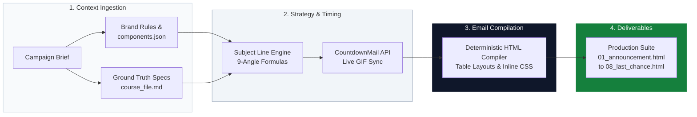

# CVZone Email Marketing Agent

> An autonomous, deterministic AI marketing campaign compiler built for [Computer Vision Zone](https://www.computervision.zone/) to upscale technical course and product sales across a community of **490K+ platform users** and **450K+ YouTube subscribers**.

---

## ⚡ Problem vs. Solution

| Challenge | ❌ Generic LLM Prompts | ✅ CVZone Campaign Agent |
|:---|:---|:---|
| **Accuracy & Pricing** | Hallucinates non-existent specs, features, and discount rates. | **Zero-Hallucination Grounding** constrained strictly to verified course specs (`course_file.md`). |
| **Brand Voice** | Falls into corporate buzzwords (*"synergy", "unlock your potential"*). | **Persona Guardrails** enforcing Murtaza's practical, direct, "learn-by-building" tone. |
| **HTML Deliverability** | Brittle CSS and div layouts that break across Outlook and Gmail. | **100% Client-Compatible** table-based inline CSS (600px) with hidden preheader hacks. |
| **Pacing & Fatigue** | Repeats generic "buy now" sales pitches across multi-day blasts. | **9-Angle Narrative Sequencing** rotating through Real-World Stories, Demos, ROI, and Urgency. |

---

## 🎯 Core Use Cases

| Scenario | Sequence Arc | Trigger & Focus |
|:---|:---:|:---|
| ⚡ **Course Flash Sales** | 4–8 emails (3–7 days) | High-urgency seasonal discounts with live CountdownMail timer sync and crossed-out pricing. |
| 🚀 **Product Launches** | Multi-stage launch arc | Outcome-driven SaaS/developer tools (e.g., *PySimverse Kickstarter*) highlighting founder seats. |
| 🎬 **YouTube Video Blasts** | Curiosity-driven single blast | Community traffic drivers using the "Curiosity Rule" (hooks without giving away the conclusion). |
| 📢 **Lesson Announcements** | Single update release | Informs existing students of newly added CV/robotics modules with live project GIF previews. |

---

## ⚙️ Architecture & Workflow

---

## 📬 Sample Generated Email Preview

Below is an authentic sample of an announcement email (**`01_announcement.html`**) generated by the agent for the *Computer Vision with CCTV* campaign, formatted for both GitHub and IDE Markdown previews:

---

**COMPUTER VISION ZONE • SPECIAL FLASH SALE**

---

### 🚨 The demand for AI in CCTV is skyrocketing. Here is how to get ahead.

**Hey Visionary,**

Security cameras are installed everywhere—yet 95% of them are completely passive. They record video, consume storage, and do nothing until an incident has already occurred.

The industry is rapidly shifting to **active edge AI analytics**, and companies are actively searching for developers who can build automated, real-time computer vision monitoring systems.

  

---

### 🛠️ What You Will Actually Build

In this course, you won't study dry theory. You will build **26 real-world commercial CCTV applications** from scratch:

|  <b>Real-Time Threat & Weapon Detection</b> |  <b>Automatic License Plate Recognition (ANPR)</b> |
|:---:|:---:|
|  <b>Workplace & Elderly Fall Detection</b> |  <b>Smart Retail Footfall & Customer Analytics</b> |

* **Hands-on Implementation:** Clean Python, OpenCV, and deep learning architectures.
* **Modern GUI & Dashboard:** You don't just output terminal logs; you learn to build professional monitoring interfaces.
* **Edge & RTSP Streaming:** Connect directly to IP cameras, process multi-camera feeds, and trigger immediate alerts.

---

### 🏷️ Limited-Time Discount: 20% Off

For the next 7 days, get complete lifetime access to all 26 projects with our launch discount:

| Course / Package | Regular Price | Sale Price | What's Included |
| :--- | :---: | :---: | :--- |
| **Computer Vision with CCTV (Complete)** | ~~$149~~ | **$119** | **26 Projects + Code + Updates** |

🔒 **3-Day Money-Back Guarantee** &nbsp;•&nbsp; ♾️ **Lifetime Access** &nbsp;•&nbsp; 📜 **Certificate of Completion**

 

[-111111?style=for-the-badge&logo=rocket)](https://www.computervision.zone/courses/computer-vision-with-cctv/)

---

Computer Vision Zone • Learn by Building Real Projects 
Questions? Reply directly to this email or reach us at <a href="mailto:contact@computervision.zone">contact@computervision.zone</a> 
<a href="#">Unsubscribe</a> • <a href="https://www.computervision.zone">Visit Website</a>

---
